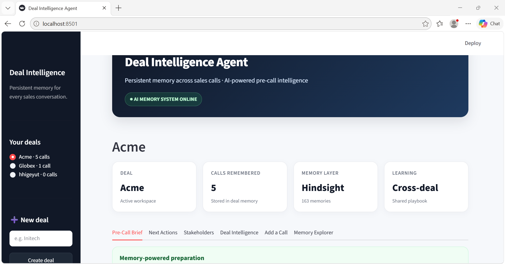

# Deal Intelligence Agent

**A sales-call agent that remembers every deal, and learns what works across all of them.**

Sales reps lose hours re-reading CRM notes before each call, and the lessons from one deal rarely reach the next. Deal Intelligence Agent turns raw call transcripts into persistent memory using [Hindsight](https://hindsight.vectorize.io/), then briefs the rep before the next call with the deal's full history plus tactics that worked on *other* deals.



> A brand-new deal (Globex, one call in) gets a brief that cites concrete tactics learned on a different deal (Acme). The agent got smarter without anyone writing a playbook.

---

## What it does

1. **Ingest a call.** Paste a transcript. An LLM extracts objections, stakeholders, pricing signals, next steps, and any *resolutions* (the specific move that defused an objection).
2. **Retain to memory.** Facts are stored in Hindsight, both in that deal's private memory and in a shared cross-deal playbook.
3. **Brief before the next call.** The agent recalls the deal's history and similar objections from other deals, then drafts a short prep brief.

## Two kinds of memory (how Hindsight is used)

| Memory | Hindsight bank | What's retained | What it enables |
|---|---|---|---|
| **Per-deal** | `deal-<deal_id>` (one bank per deal) | Objections, stakeholders, pricing signals, next steps, resolutions, tagged by call number | The brief gets richer call after call: what was promised, who approves, which objections keep resurfacing |
| **Cross-deal playbook** | `playbook` (one shared bank) | Deal-agnostic objections and `TACTIC that worked...` entries, tagged by category and source deal | A brand-new deal is smarter on day one, because recall surfaces what worked elsewhere |

**Why resolutions matter.** Early on, the playbook only stored objections, so cross-deal briefs were generic sales advice. Capturing the *resolution* (for example, "offered an annual plan at an effective $600/month, below the CFO's ceiling") gives recall something concrete and attributable to retrieve. That single change is what made cross-deal memory visible in the output.

Calls used: `retain` (after every ingested call) and `recall` (before every brief). Memory is the core of the product, not an add-on: without it the agent has nothing to brief from.

## Architecture

```
 transcript
     |
     v
 extract.py   -- LLM (Groq) -> structured JSON
     |             objections, resolutions, stakeholders,
     |             pricing_signals, next_steps
     v
 memory.py    -- Hindsight retain()
     |             -> deal-<id> bank   (everything about this deal)
     |             -> playbook bank    (objections + tactics, deal-agnostic)
     v
 brief.py     -- Hindsight recall() from both banks
     |             -> LLM drafts the pre-call brief
     v
 ui/app.py    -- Streamlit: brief, add a call, inspect raw memory
```

## Project structure

```
deal-intelligence-agent/
├── README.md
├── requirements.txt
├── .env.example
├── run_demo.py              # end-to-end terminal demo
├── src/
│   ├── config.py            # env loading, Hindsight + Groq clients
│   ├── extract.py           # transcript -> structured facts
│   ├── memory.py            # Hindsight retain/recall (deal + playbook banks)
│   ├── brief.py             # recalled memory -> prep brief
│   ├── agent.py             # ingest_call(), prep_next_call()
│   └── deals_store.py       # local deal registry for the UI
├── ui/
│   └── app.py               # Streamlit app
└── data/
    └── transcripts/         # synthetic sample calls (Acme x2, Globex x1)
```

## Setup

**Prerequisites:** Python 3.10+, a Hindsight Cloud API key ([ui.hindsight.vectorize.io](https://ui.hindsight.vectorize.io)), and a Groq API key ([console.groq.com](https://console.groq.com)).

```bash
git clone <https://github.com/sidra-tahseen/Deal-Intelligence-Agent>
cd deal-intelligence-agent
pip install -r requirements.txt
```

Create your env file (it must be named exactly `.env`):

```bash
# macOS / Linux
cp .env.example .env

# Windows (PowerShell)
copy .env.example .env
```

Then fill in `.env`:

```
HINDSIGHT_API_KEY=your-hindsight-api-key
HINDSIGHT_BASE_URL=https://api.hindsight.vectorize.io
GROQ_API_KEY=your-groq-api-key
GROQ_MODEL=openai/gpt-oss-120b
```

## Run it

**Terminal demo** (ingests the sample calls and prints each brief):

```bash
python run_demo.py
```

**Web UI:**

```bash
streamlit run ui/app.py
```

In the sidebar, create deals named `Acme` and `Globex`. Names are slugified into Hindsight bank IDs (`deal-acme`, `deal-globex`), so they reconnect to memory created by `run_demo.py`.

## Demo walkthrough

1. Run `python run_demo.py` once to populate memory (or ingest the sample transcripts from the **Add a Call** tab).
2. Open **Acme**: generate a brief. It reflects both calls: price gap, CFO approval threshold, competitor, timeline.
3. Open **Globex** (one call only): generate a brief. The **Tactics that worked elsewhere** section cites Acme's annual-plan discount, comparison sheet, and ROI framing.
4. Open the **Raw Memory** tab to see exactly what Hindsight recalled, separate from the LLM-written brief.

## Design notes

- **One bank per deal, one shared playbook.** Bank boundaries make isolation explicit: a deal's private details never leak into another deal's brief, while the playbook holds only deal-agnostic patterns.
- **Recall queries are capped.** Hindsight limits queries to 500 tokens, and a naive query built from accumulated history exceeds that after a few calls. `memory.py` truncates queries defensively, and `brief.py` builds them from only the most recent objections, which are also the ones most likely to resurface.
- **Metadata values are strings.** The Hindsight client validates metadata as `dict[str, str]`, so all values are stringified before retain.
- **Grounding over fluency.** The brief prompt prefers recalled `TACTIC` entries over generic advice, and labels anything else as a suggestion rather than a proven tactic.
- **App bookkeeping stays outside Hindsight.** `data/deals.json` tracks which deals exist and their call counts; Hindsight stores what was *said*.

## Limitations

- Sample data is synthetic. The pipeline is transcript-in, so real call transcripts would work the same way, but this hasn't been tested on real recordings.
- The brief's wording is LLM-generated. The tactics are retrieved from memory, but the model can occasionally embellish details (for example, adding "total cost of ownership" framing that wasn't in the source call).
- Resolutions are only extracted when a transcript shows a concrete move that defused an objection, so a vague "I'll follow up" won't create a playbook entry.
- Deal registry is a local JSON file, so it isn't shared across users or machines.

## Tech stack

- [Hindsight](https://hindsight.vectorize.io/) for persistent agent memory ([source](https://github.com/vectorize-io/hindsight), [what is agent memory](https://vectorize.io/what-is-agent-memory))
- [Groq](https://groq.com/) with `openai/gpt-oss-120b` for extraction and brief generation
- [Streamlit](https://streamlit.io/) for the UI
- Python

